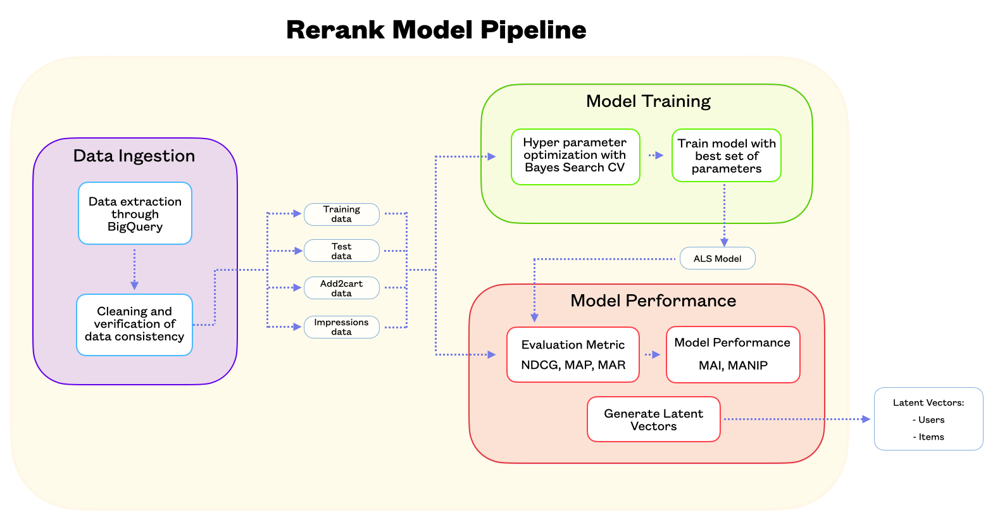

# Nautilus-Rerank-Model

This project involves the creation of a rerank system pipeline based on the Alternating Least Squares Model, using classes for data ingestion, matrix creation, model training, optimization, evaluation, and storage of latent vectors.

## Requirements

This project uses Python 3.10. Make sure your environment uses the same version.

Tables needed to construct the affinity matrix

Add to cart items for LiderApp:
- `wmt-1257d458107910dad54c01f5c8.search.search_a2c`
Customer search results for LiderApp:
- `wmt-1257d458107910dad54c01f5c8.dw_customer_search_recom_se.vds_customer_search_result`

Raise Active Directory ticket

Select environment as __Production__ and activity as __Modify Active Directory Group Membership__. 
The __AD Group__ necessary is: 
- `GCP-CL_CUSTOMERINT_SEARCH_SEARCH`

## Installation

To install the project, clone the repositorry in your machine and then eecute the following command:
- `chmod +x install_packages.sh`
- `./install_packages.sh`

## How to run

To run the pipeline execute the following command:
- python pipeline/main.py

## Structure of the Model: Classes and Methods

### DataIngestion

This class is used to handle data ingestion and processing from an SQL database. It provides several methods to load data, preprocess it, and then return relevant information. The class's methods include:

- `__init__()`: Initializes the class with relevant fields.
- `__str__()`: Returns a string representation of the instance.
- `get_query_path()`: Generates the path to the SQL query file inside a designated query folder.
- `get_query()`: Reads the SQL query from the file at the given path.
- `ingest_data()`: Runs the SQL query and ingests the data into a pandas DataFrame.
- `get_user_item_matrix()`: Creates a DataFrame from the input SQL query and preprocesses it.
- `get_add2cart()`: Ingests data about which items users added to their shopping carts.
- `get_impression()`: Ingests data about which items users viewed (impressions).

### EvaluationMetrics

This class is designed to evaluate the performance of a recommendation model. It takes in a model, a test matrix, a value of k (number of products to test), and a choice of evaluation metric (either dot product or Euclidean distance) as inputs. The class's methods include:

- `__init__()`: Initializes the class with relevant fields.
- `__str__()`: Returns a string representation of the class.
- `check_vector_existance()`: Verifies if all users and items in the test matrix exist in the latent vectors of the model.
- `create_sparse_matrix()`: Creates a sparse matrix from a given DataFrame.
- `prediction_matrix()`: Creates a matrix of predictions based on the model and the evaluation metric.
- `prepare_matrix()`: Prepares the test and prediction matrices for evaluation.
- `get_top_k_items()`: Returns the top 'k' items for each user, sorted by their ratings.
- `sort_itemids()`: Sorts the values of each row in descending order.
- `top_k_most_relevat_items()`: Selects the top 'k' most relevant items for each user.
- `top_k_prediction_items()`: Selects the top 'k' prediction items for each user.
- `ndcg_at_k()`: Computes the Normalized Discounted Cumulative Gain at top 'k' products.
- `map_at_k()`: Computes the Mean Average Precision at top 'k' products.
- `mar_at_k()`: Computes the Mean Average Recall at top 'k' products.
- `compute_metric()`: Evaluates all the metrics: ndcg, map, and mar.

### ALSModelWrapper

This class is a wrapper around the Alternating Least Squares (ALS) model, designed to fit into the scikit-learn framework. The class's methods include:

- `__init__()`: Initializes the class with relevant fields.
- `fit()`: Trains the ALS model on the input data `X`.
- `score()`: Evaluates the trained ALS model on the input data `X`.

### ModelPerformance

This class is used to evaluate the performance of an ALS model. The class's methods include:

- `__init__()`: Initializes the class with relevant fields.
- `__str__()`: Returns a string representation of the class.
- `sample_a2c()`: Computes a sample dataframe for each 'search_query' group.
- `merge_a2c_imp()`: Merges the 'add to cart' table with the 'impressions' table.
- `create_new_matrix_vector()`: Creates a matrix with the values of the latent vectors.
- `compute_prediction()`: Computes the dot product between the user and the items matrix.
- `sort_prediction()`: Sorts only the 'imp_itemid', 'prediction' columns.
- `imp_at_k()`: Computes the Different Position between the current and predicted position.
- `mai_at_k()`: Computes the Mean Average Improvement and Mean Average Number of Improvement Positions.
- `mai_at_k_by_product()`: Computes the Mean Average Improvement per group of search query.
- `q10()`, `q25()`, `q50()`, `q75()`, `q90()`: Calculate the 10th, 25th, 50th, 75th, and 90th percentiles, respectively.
- `compute_metric()`: Uses all the methods above to calculate the performance metrics of the model.

### ALSModel

This class is a wrapper around the Alternating Least Squares (ALS) algorithm. The class's methods include:

- `__init__()`: Initializes the class with the number of factors, regularization parameter, alpha parameter, and the number of iterations.
- `__str__()`: Returns a string representation of the model.
- `create_sparse_matrix()`: Transforms a given DataFrame into a sparse matrix. The sparse matrix is a user-item matrix which is used in recommendation systems.
- `get_latent_vectors()`: Extracts the latent vectors from the trained model. These latent vectors represent users and items in a lower-dimensional space, which is actually the 'nfactors' dimensional space. 
- `train_model()`: Fits the model with the sparse matrix. After training the model, it extracts the latent vectors.
- `store_latent_vectors()`: Saves the latent vectors of users and items into separate CSV files. 

The data flow in the described pipeline can be visualized as follows:

1. Data is first ingested from an SQL database using the `DataIngestion` class. This involves executing SQL queries specified in files to extract data on 'add to cart' events (`matrix_a2c`), 'impressions' (`matrix_imp`), and user-item interactions for training (`training_matrix`) and testing (`test_matrix`).

2. This ingested data is then used to train a model using the Alternating Least Squares (ALS) algorithm. This is done using the `BayesSearchCV` class from the scikit-optimize library, which performs hyperparameter tuning using Bayesian optimization over specified parameters. The `ALSModelWrapper` class is used as an interface between the ALS model and `BayesSearchCV`.

3. The model with the best hyperparameters is then retrained on the training data using the `ALSModel` class. The trained model's latent vectors, which represent users and items in a lower-dimensional space, are stored for future use.

4. The performance of the trained model is evaluated using the `EvaluationMetrics` class, which computes metrics such as Normalized Discounted Cumulative Gain (NDCG), Mean Average Precision (MAP), and Mean Average Recall (MAR) at a specified number of top products. The evaluation is done on the test data.

5. The trained model's performance is also evaluated using the `ModelPerformance` class, which computes metrics such as Mean Average Improvement (MAI) and Mean Average Number of Improvement Positions (MANIP) on 'add to cart' events for a sample of the top K products.

6. Finally, the latent vectors of the trained model are stored using the `store_latent_vectors` method of the `ALSModel` class.

Here's a diagram representing this data flow:

In this diagram, the arrows represent the flow of data.

## Input parameters of the model

### Date Parameters
This dictionary contains the time range used for training and testing the ALS model:

- `init_train_date`: This is the start date for the training period. It is given in 'YYYYMMDD' format.
- `end_train_date`: This is the end date for the training period. It is also given in 'YYYYMMDD' format.
- `test_date`: This is the date on which the model will be tested. It is given in 'YYYYMMDD' format.

### Queries Parameters
This dictionary contains the SQL queries used to retrieve the necessary information for training and testing:

- `a2c_matrix`: This is the SQL query used to generate the add-to-cart matrix. This matrix may contain information about which users added which items to their carts.
- `imp_matrix`: This is the SQL query used to generate the impressions matrix. This matrix may contain information about which users viewed which items.
- `train_matrix`: This is the SQL query used to generate the training matrix. This matrix may contain the user-item interactions used for training the model.
- `test_matrix`: This is the SQL query used to generate the test matrix. This matrix may contain the user-item interactions used for testing the model.

### Scan Parameters Model
This dictionary contains the hyperparameters that will be tested in the model:

- `nfactors`: This is the number of latent factors. Latent factors are underlying dimensions that explain the observed user-item interactions. The model will be tested with 10 and 50 latent factors.
- `regularization`: A parameter to prevent overfitting. Larger values specify stronger regularization. The model will be tested with a regularization parameter of 1 and 30.
- `alpha`: This is the confidence parameter and it governs the baseline confidence in preference predictions. The model will be tested with an alpha of 40 and 80.
- `iterations`: The number of iterations to run the ALS algorithm. More iterations can lead to a more accurate model but also increase the computational cost.

### Evaluation Parameters
This dictionary contains the parameters used to evaluate the model's performance:

- `cutoff_k`: The number of top-ranked items to consider when calculating NDCG, precision and recall. In this case, only the top 20 items are considered.
- `evaluation_metric`: This is the metric used to evaluate the model. It can be either dot_product or euclidean_distance, however dot_product shows better performence.
- `top_n_products`: This represents the number of top products to consider when evaluating the model. Increasing this number the evaluation will consider more products, which might make it more accurate Main Average Improvement but also more computationally expensive.
- `sample_size`: This number represents the size of the sample that the class is going to compute for each product. It's a number between 0 and 1, representing a percentage of the total data. If you increase this number, the evaluation will consider more data, making it more accurate but also more computationally expensive. 20% of the data will be used in this case.

### BayesSearchCV Parameters
This dictionary contains the hyperparameters for the BayesSearchCV method:

- `n_iter`: This is the number of iterations for the Bayesian optimization process. It will run for 20 iterations.
- `cv`: This is the number of folds in the cross-validation. There will be 3 folds.
- `n_jobs`: This is the number of CPU cores to use. It will use 8 cores.
- `verbose`: This is the verbosity level. A verbosity of 2 means that it will output the score after each iteration.
